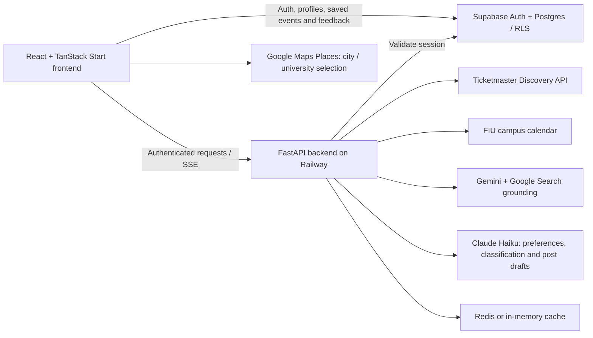

# Scout

**Live app:** [goscoutapp.com](https://goscoutapp.com)

**Find events that fit your interests. Turn going out into something worth sharing.**

Scout helps college students discover relevant events without checking a dozen calendars and social feeds. Tell Scout your city, university, major, interests, and your current **vibe** in your own words. Browse a personalized feed, save events, record a visit, and draft a LinkedIn or X post about the experience.

## Project timeline — a note for judges

The idea and an early version of Scout date back to **spring 2026**. The current working implementation of its core features came together recently, ahead of this presentation. **Scout was not built from scratch during this hackathon.** This repository is a fresh, sanitized snapshot for review; its initial commit marks this publication, not the beginning of development. GoScout was developed and significantly enhanced during ShellHacks 2026. During the hackathon, we focused on bringing the platform together into a complete, polished experience, improving AI-powered event discovery and personalization, refining the search and recommendation pipeline, and preparing the application for real-world use.

## What to try

1. Sign up or sign in and complete onboarding with your city, school, major, and interests.
2. Describe a vibe, such as “AI meetups, live music, and relaxed networking in Miami.”
3. Explore **My Picks**, events related to your **Major**, or a natural-language **Search**.
4. Save an event, then mark it attended and share a rating and a short impression.
5. Generate an editable LinkedIn or X draft and copy it to your clipboard.

Results stream in progressively. Structured event sources provide the backbone, while AI discovery expands coverage. FIU in Miami is the initial campus-calendar integration; SeatGeek is optional.

## Architecture



- **Frontend:** React, TypeScript, TanStack Start/Router, Vite, Tailwind CSS, and shadcn/Radix components.
- **Backend:** Python/FastAPI, deployed separately on Railway; event normalization, caching, rate limits, AI orchestration, and SSE responses.
- **Persistence:** Supabase authentication and Postgres tables for profiles, saved events, attended events, and feedback. SQL migrations include row-level security policies.
- **Discovery:** Ticketmaster and campus calendar data plus Gemini grounded search. Claude Haiku extracts preference signals, classifies events, decomposes searches, and drafts posts.
- **Deployment:** The frontend includes a server route for public Maps configuration and uses TanStack Start/Nitro. It is not a static HTML-only application.

## Run locally

### Prerequisites

- Node.js **22.12 or newer** (Node 22 is the recommended baseline) and npm.
- Python **3.11 or newer**.
- A Supabase project, a Google Maps browser key with Places enabled, and Ticketmaster, Gemini, and Anthropic API credentials for the full experience.
- Redis is optional. External API use may incur charges; configure your own quotas.

### 1. Install and configure the frontend

```bash
git clone https://github.com/heyitsmaks/scout.git
cd scout
npm ci
cp .env.example .env.local
```

Fill in `.env.local`:

| Variable                        | Purpose                                                                                   |
| ------------------------------- | ----------------------------------------------------------------------------------------- |
| `VITE_API_URL`                  | Local backend: `http://localhost:8000`                                                    |
| `VITE_SUPABASE_URL`             | Your Supabase project URL                                                                 |
| `VITE_SUPABASE_PUBLISHABLE_KEY` | Your public Supabase publishable key; a legacy `VITE_SUPABASE_ANON_KEY` is also supported |
| `VITE_GOOGLE_MAPS_BROWSER_KEY`  | Google Maps browser key used for city/university autocomplete                             |
| `VITE_SENTRY_DSN`, `SENTRY_DSN` | Optional client/server monitoring                                                         |

Every `VITE_` variable is browser-visible. Never use a Supabase service-role key or an AI provider secret in one of these variables. Restrict the Maps key to the intended HTTP referrers and APIs. City selection during onboarding requires working Places configuration.

### 2. Prepare Supabase

Apply the SQL files in `supabase/migrations/` in filename order to your own project, using the Supabase SQL editor or your normal Supabase CLI migration workflow. They create `profiles`, `saved_events`, `attended_events`, and `feedback`, including grants and RLS policies.

Enable email/password authentication. Configure the Site URL as `http://localhost:5173` and allow local redirect URLs for `/`, `/feed`, and `/auth`. Google and Apple login buttons require separately configured OAuth providers; email/password can be used without those providers. Account confirmation behavior follows your Supabase settings.

The frontend and backend **must use the same Supabase project**. Existing deployed services and data are not copied by cloning this repository.

### 3. Start the backend

In a separate terminal:

```bash
cd scout/backend
python3 -m venv .venv
source .venv/bin/activate
# Windows PowerShell: .venv\Scripts\Activate.ps1
python -m pip install -r requirements.txt
cp .env.example .env
```

Fill in `SUPABASE_URL`, `SUPABASE_ANON_KEY` (the project's public anon/publishable key), `TICKETMASTER_API_KEY`, `GEMINI_API_KEY`, and `ANTHROPIC_API_KEY`. Keep `ALLOWED_ORIGINS=http://localhost:5173` for this local setup.

```bash
python -m uvicorn main:app --reload --port 8000
```

Health check: `http://localhost:8000/api/health`. Interactive API documentation: `http://localhost:8000/docs`. Event and post endpoints require a signed-in user's Supabase token.

### 4. Start the frontend

From the repository root:

```bash
npm run dev -- --port 5173
```

Open `http://localhost:5173`. If you choose another frontend port, update CORS and your Supabase redirect configuration to match.

## Checks

```bash
npm run build
npm run typecheck
npm test
npm run lint
```

Backend unit checks (from `backend/`, with the virtual environment activated):

```bash
python test_gemini_budget.py
python test_stale_events.py
python test_regressions.py
```

These scripts exercise budget limits, account-independent backend behavior, cancellation and stale-event/timezone handling without calling paid AI services. `test_gemini.py` is a separate live API diagnostic and may incur usage. `test_cache_stats.py` is an offline authorization regression check for the protected cache-statistics endpoint.

The inherited lint backlog is documented in [known limitations](KNOWN_ISSUES.md); a successful build is not a claim that all lint checks pass.

## Deploying the backend on Railway

Use `backend/` as the service root and its `Procfile` start command. Supply backend environment variables through Railway, set `ENVIRONMENT=production`, and set `ALLOWED_ORIGINS` to the actual frontend origin. Configure the deployed frontend's `VITE_API_URL` to use that backend. Add production OAuth redirect URLs and Maps referrer restrictions for your frontend domain.

Redis provides shared caches and counters. Without it, rate limits and budgets are process-local; use one backend process for this setup. Keep API credentials in deployment secrets, not in repository files.

## Repository map

```text
src/
  routes/                 Landing, auth, onboarding, feed and profile
  components/             Event cards, attendance survey, post generator and UI
  hooks/                  Streaming, filters and profile/event synchronization
  lib/                    Auth, configuration, maps and saved-event helpers
  integrations/supabase/  Database types and integration helpers
backend/
  main.py                 FastAPI, event sources, AI, caches and request limits
  test_*.py               Unit checks and manual diagnostics
supabase/migrations/      Database schema, grants and RLS
public/                   App icons and PWA manifest
```

## Cost controls

`GEMINI_DAILY_CALL_LIMIT` defaults to 1400 attempts/day; `ANTHROPIC_DAILY_CALL_LIMIT` defaults to 500. Set either to `0` to disable that provider. `AI_STREAM_HOURLY_LIMIT` defaults to 10 uncached streams per user. These are call ceilings, not dollar budgets. Use Redis for shared counters and configure spending limits with your providers. See [known limitations](KNOWN_ISSUES.md).

## Current boundaries

- Saved events and date filtering are available; external calendar sync and ICS export are not implemented.
- Posts are drafts you edit and copy; Scout does not publish automatically to social networks.
- AI-discovered dates and links may be incomplete or wrong. URL checks are not a guarantee that an event has been independently verified; confirm details on the organizer's page.
- Search depends on third-party availability and can take time. Campus-calendar coverage currently starts with FIU.
- Known synchronization and streaming limitations are described in [KNOWN_ISSUES.md](KNOWN_ISSUES.md).

Built by **Maksim (@heyitsmaks)**, Bakai(@asylbekovbakai22). This public snapshot contains no previous Git history or deployed credentials. See [SECURITY.md](SECURITY.md) for credential handling.
